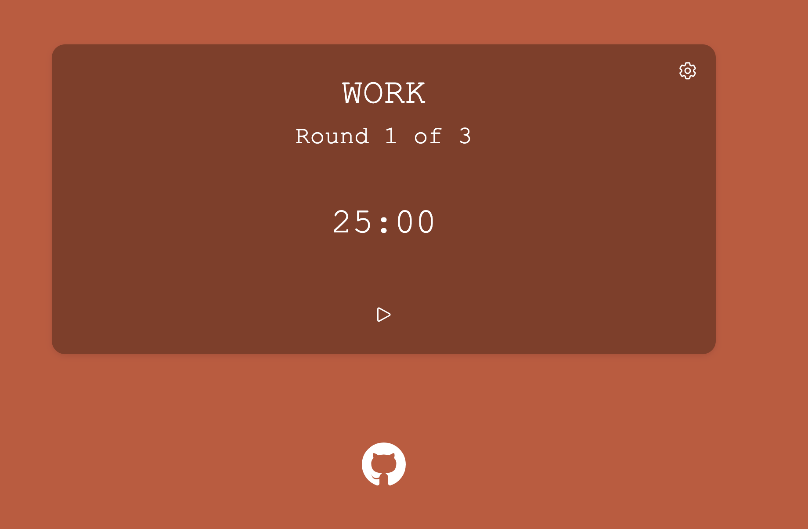

# Gabriel Wright 🌞

Hello - I am Gabriel. Professionally I work as a Software Developer.
I'm most confident working with **Java**, but I also use **JS/TS**, **React** professionally and work with other technologies e.g. _C#, Python_ for personal projects.

## Check out Unity game my friends and I made here 😸

## Check out this helpful Pomodoro Timer I made as well ⌚️

## Check out my personal blog here too! 💻

### Languages and tools i've used 🧰 

 

